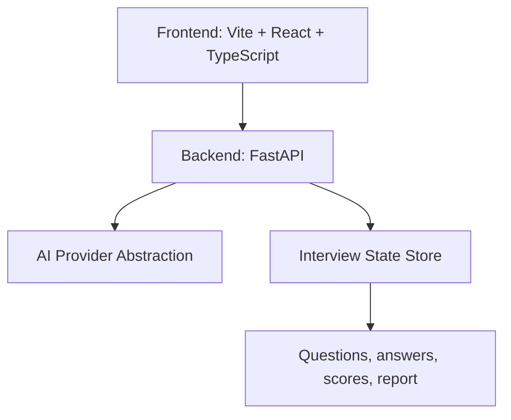

# InterviewX

InterviewX is the LoRveX hackathon project for the ABTalks Vibe Code Hackathon: an autonomous AI interviewer that adapts questions based on the candidate, the role, and prior answers.

This repository is being built incrementally so the architecture stays modular, testable, and easy to extend during live-steer rounds.

## Current Status

Phase 1 foundation:

- Root project documentation
- Environment example file
- Ignore rules for local secrets and build outputs
- Minimal backend shell
- Minimal frontend shell

## Product Direction

The long-term goal is a polished adaptive interview platform with:

- Candidate and resume intake
- Interview planning
- Contextual questioning
- Answer evaluation
- Adaptive follow-up logic
- Final reporting and analytics

## Initial Architecture

## Repository Layout

- frontend/ - React app for the interview experience
- backend/ - FastAPI service for interview APIs and AI orchestration
- PROMPTS.md - AI usage log for hackathon authenticity
- .env.example - environment variable template

## Setup

1. Install frontend dependencies in `frontend/`.
2. Install backend dependencies in `backend/`.
3. Copy `.env.example` to `.env` and fill in local values.
4. Start the backend and frontend in separate terminals.

## Environment Variables

See [.env.example](.env.example).

## Live Demo

Placeholder until deployment is added.

## AI Usage

See [PROMPTS.md](PROMPTS.md).

## Team

LoRveX
