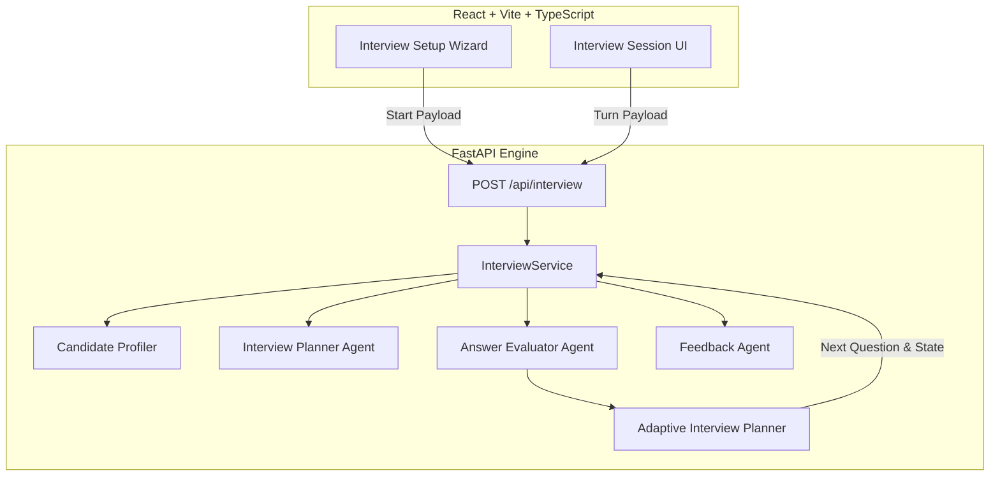

# LoRveX — Candidate-Aware AI Technical Interview Agent

> **"Build the interviewer, not the interview."**

LoRveX is an autonomous, candidate-aware AI technical interviewer built for the 31-day enterprise AI Cohort. Rather than asking a static questionnaire, LoRveX listens to the candidate's answers, evaluates technical claims, detects misconceptions, probes edge cases, adaptively scales difficulty, and tracks curriculum coverage across the cohort journey.

---

## 🎯 The Problem & Solution

### The Challenge
After completing a 31-day AI engineering program (covering RAG, Vector DBs, Prompting, Agentic AI, MCP, deployment, and observability), candidates often struggle to communicate their technical reasoning and engineering tradeoffs in live interviews.

### The LoRveX Solution
LoRveX conducts realistic, multi-turn technical interviews tailored to each candidate's cohort signals (completed missions, first-try passes, skipped topics, and experience level).

---

## 💡 Key Differentiators

1. **Candidate-Aware Profiling**: Uses cohort signals (completed/skipped missions, first-try attempts) to personalize interview strategy.
2. **Real Follow-up Intelligence**: Extracts technical claims & terms (e.g., *"embeddings"*, *"vector search"*, *"hallucinations"*) from candidate responses and crafts targeted follow-ups.
3. **Misconception Detection**: Detects false technical claims (e.g. *"RAG eliminates all hallucinations"*) and probes limitations and edge cases rather than moving away.
4. **Adaptive Difficulty Scaling**: Automatically adjusts question difficulty (`easy` / `medium` / `hard`) and question modes (`conceptual`, `architecture`, `debugging`, `tradeoff`, `scenario`, `followup`, `reflection`).
5. **Authoritative Backend Enforcement**: Guarantees a minimum of **8 questions** covering at least **4 unique curriculum days** before generating structured final feedback.

---

## 🏗️ Architecture & Data Flow



---

## 📋 Mandatory Requirements Compliance

| Requirement | Implementation Detail | Status |
| :--- | :--- | :--- |
| **Conversational Technical Interview** | Single stateful HTTP endpoint (`POST /api/interview`) maintaining `sessionId` state turn-by-turn. | **PASSED** |
| **Minimum 8 Questions** | Enforced authoritatively in backend runtime (`len(question_history) >= 8`). | **PASSED** |
| **Minimum 4 Curriculum Days** | Tracks unique curriculum days (`len(set(covered_days)) >= 4`) before completing session. | **PASSED** |
| **Adaptive Follow-up** | Dynamic claim extraction & adaptive decision engine (`easy`/`medium`/`hard` & 8 question modes). | **PASSED** |
| **Context Preservation** | Retains question history, answer history, evaluations, covered days, and candidate profile in session runtime. | **PASSED** |
| **Structured Feedback** | Generates final feedback (`overall_score`, `summary`, `strengths`, `gaps`, `recommendations`, `topics_to_revise`, `assessments`). | **PASSED** |
| **Required HTTP Endpoint** | Strictly satisfies Technical Specification API contract for start and continue turns. | **PASSED** |

---

## 🛠️ Technology Stack

- **Frontend**: React, TypeScript, Vite, Tailwind CSS, Lucide Icons, Web Speech API (optional mic).
- **Backend**: Python 3.11+, FastAPI, Pydantic v2, Uvicorn, Pytest.
- **Data Integration**: Synthetic 31-day AI Cohort curriculum (`curriculum.json`), candidate profile database (`candidates.json`).
- **AI Abstraction**: Provider pattern (`AIProvider`, `OpenAIProvider`) with deterministic fallback strategy for offline execution.

---

## 🚀 Quick Start & Running Locally

### Backend Setup
```bash
cd backend
python -m venv venv
# On Windows:
venv\Scripts\activate
# On Unix:
source venv/bin/activate

pip install -r requirements.txt
python -m uvicorn app.main:app --host 127.0.0.1 --port 8000
```

### Frontend Setup
```bash
cd frontend
npm install
npm run dev
```

- **Frontend Application**: [http://localhost:5173/](http://localhost:5173/)
- **Interview Setup**: [http://localhost:5173/interview/setup](http://localhost:5173/interview/setup)
- **Backend Server**: [http://127.0.0.1:8000/](http://127.0.0.1:8000/)

---

## 🧪 Testing & Verification

```bash
# Run backend test suite
cd backend
python -m pytest tests -q

# Run frontend build check
cd frontend
npm run build
```

---

## 📄 Hackathon Resources & Documentation

- [PROMPTS.md](PROMPTS.md): AI-assisted development audit log.
- [technical-spec.md](backend/docs/technical-spec.md): Technical specification API definition.
